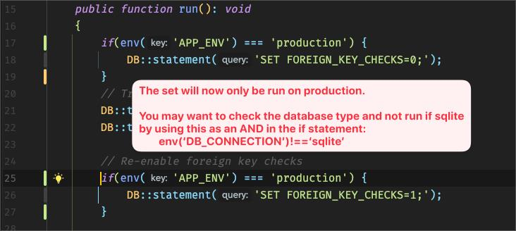
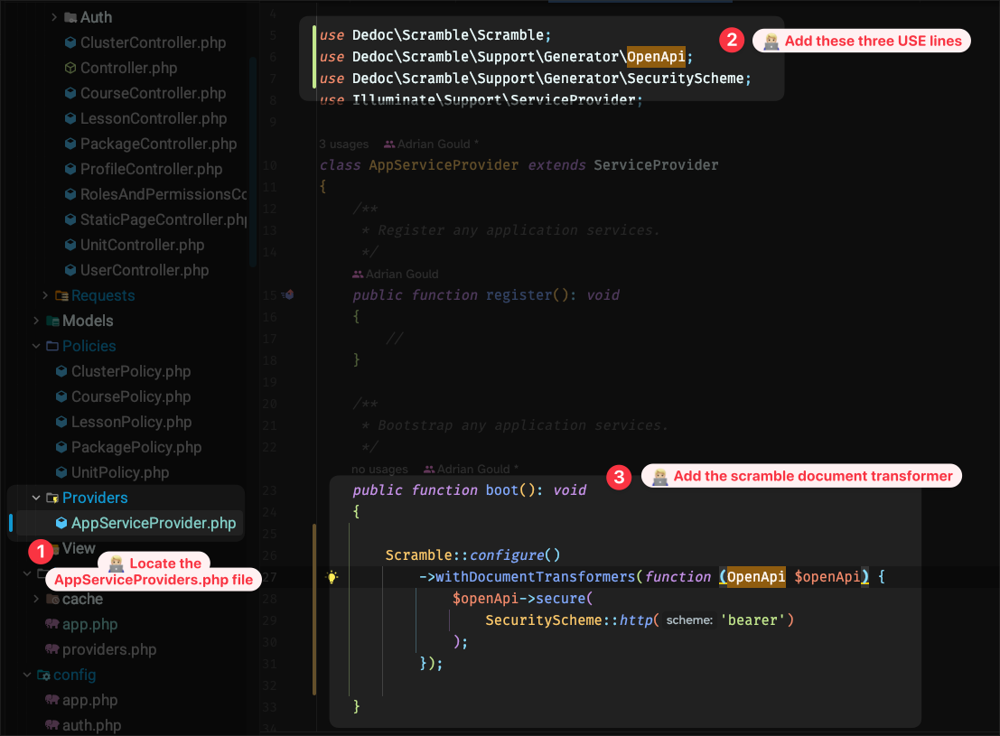
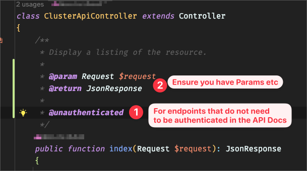
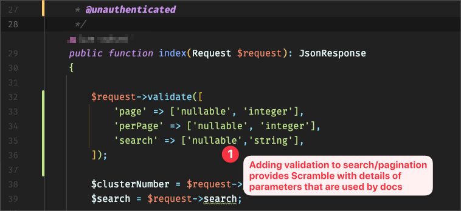

# Class Tracker Review Notes

## General

It would be good to use real data, or at least up to date.

We know we provided data for you, but it is also available from the training.gov.au website.

## UI

- Clean
- Easily navigated
- Minor gripes
    - rounded areas all the way to screen edge...
    - Home should be before Dashboard
    - Sample data... lessons all at midnight?
    - Unable to search courses which makes difficult to narrow down the list
    - could link from cluster/unit to the qualification to make easier to navigate

## API

In general, the API is solid, but there are issues to be aware of.

## Issues to consider

### The API is not protected correctly

What areas will be freely accessible without authentication and possibly permissions being
applied?

Consider the following:

- Would a normal user be able to access the users?
    - No. 
    - This is a serious security flaw.

### The API Documentation

Whilst Scramble does a good job at deducing things, it does not provide complete documentation.

You should ensure that:

- Endpoints are documented fully
- Do not rely on the live data for examples
- If an endpoint requires authentication, then it needs to be part of the documentation

For Scramble, to add authenticated endpoint information, please read, review and implement 
the following: 

- https://scramble.dedoc.co/usage/authentication
    - Requiring Authentication
    -   (ALL endpoints that add/modify/delete data MUST be authenticated!)
    - Excluding a route from authentication 
    -   (e.g. listing courses)

Live Data

It is not a good idea to rely on live data for teh examples. This is a securioty 
issue as the docs will reveal private information.

If possible, add examples to the docblocks to demonstrate what is returned.

You should be providing examples of the API use and Results

I would not be able to 'consume' the API without this vital information

## Code Items

